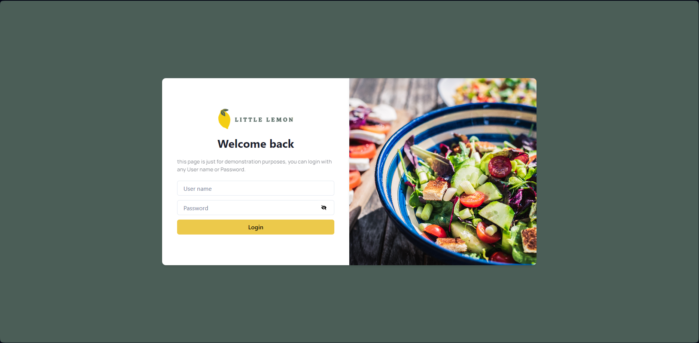
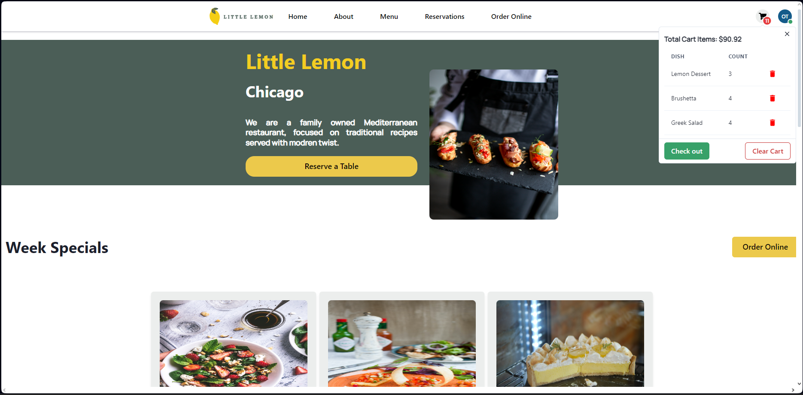
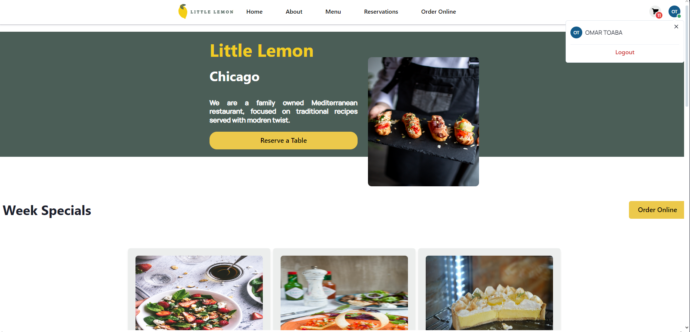
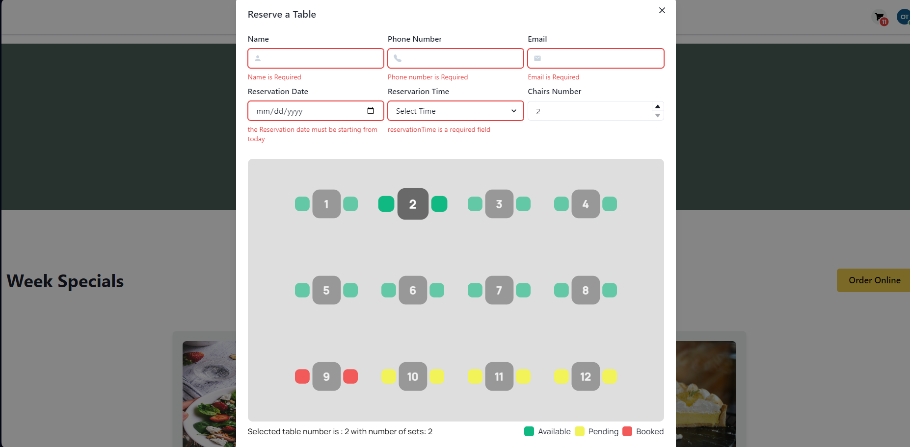
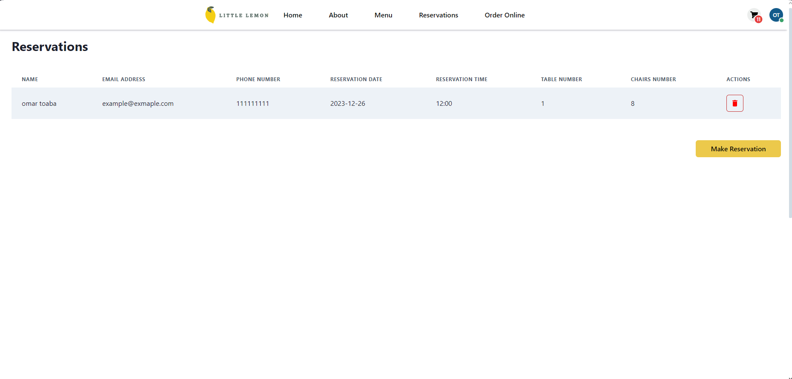
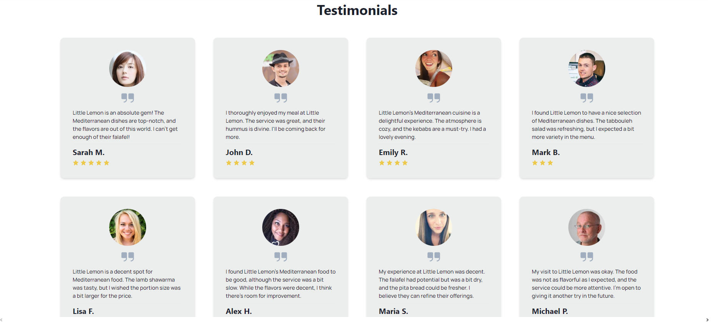
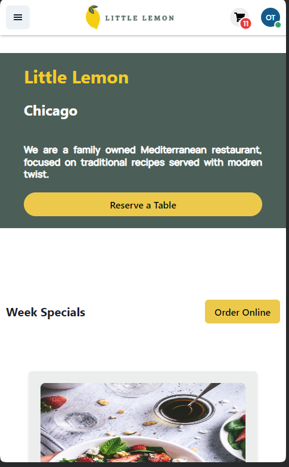

# Little Lemon Restaurant

Little Lemon is website for fictional website, it was created as part of Final capstone project for Meta Font-end developer programm

## Live Demo

you can try the website here: [Little Lemon](https://omartoaba.github.io/Little-Lemon/).

## Screenshot

### Login page

### Home page

home page with Cart and Logged user Functionality

### Table Reservation

### Reservation

### Testimonials

### Responsive Design

 

## Tech Stack

- HTML,CSS
- JSX
- REACT
- REDUX

## Third Party Libraries

- react-router-dom
- Chackra UI
- react-icons
- Fomik
- Yup
