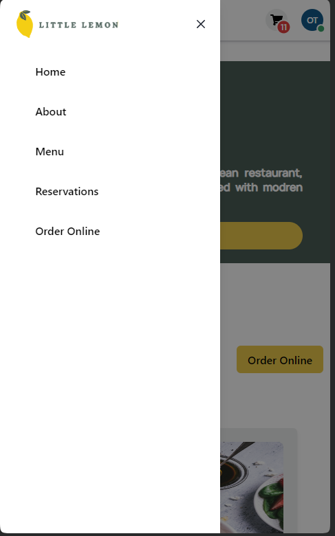

# Little Lemon Restaurant

Little Lemon is a website for a fictional restaurant, it was created as part of the Final capstone project for the Meta Front-end developer program

## Live Demo

you can try the website here: [Little Lemon](https://omartoaba.github.io/Little-Lemon/).

## Screenshot

### Login page

### Home page

home page with Cart and Logged user Functionality

### Table Reservation

### Reservation

### Testimonials

### Responsive Design

 

## Tech Stack

- HTML,CSS
- JSX
- REACT
- REDUX

## Third Party Libraries

- react-router-dom
- Chakra UI
- react-icons
- Formik
- Yup
